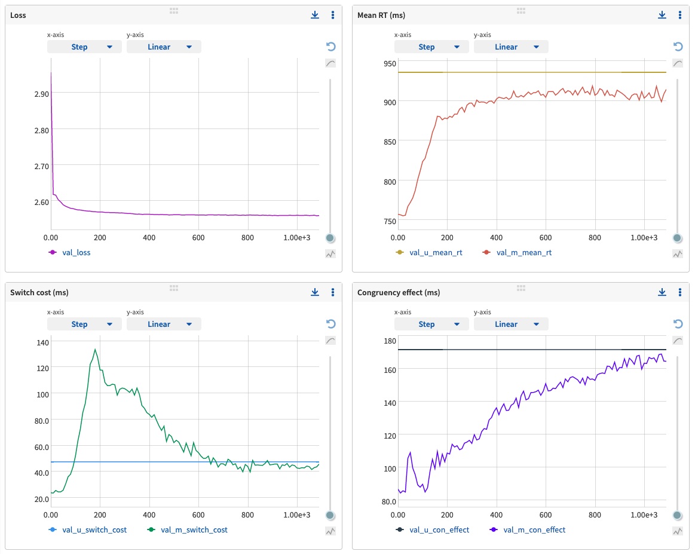
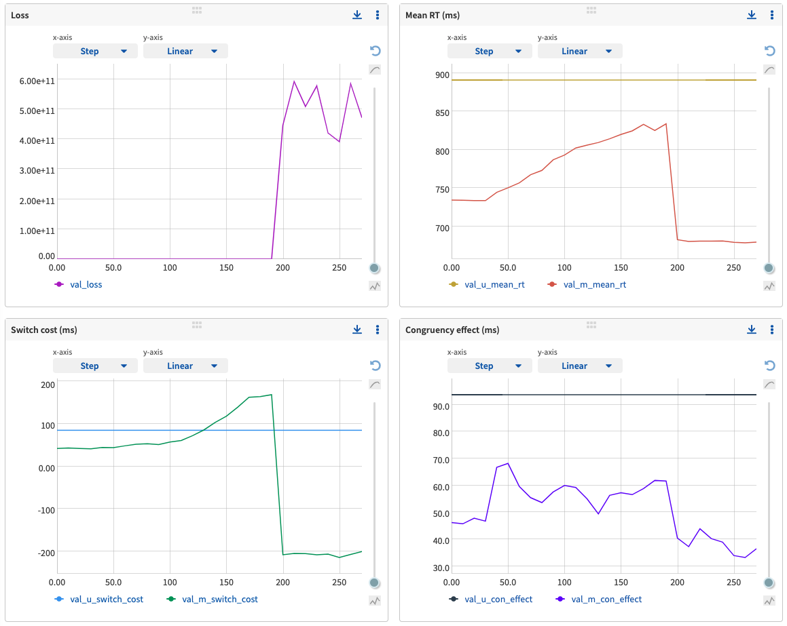

Task-DyVA
------------

Task-DyVA (pronounced dee-vuh) is a framework for modeling sequential response time data from cognitive tasks. This repo contains code to train models and reproduce the analyses from the paper. 

Preprint: Jaffe PI, Poldrack RA, Schafer RJ, Bissett PG. 2022. Discovering dynamical models of human behavior. bioRxiv. 

Trained models & data: [](https://doi.org/10.5281/zenodo.6368413)


Reproduce the figures and analyses from the paper
------------

The easiest and recommended way to reproduce the results from the paper is as follows:

1) Fork the repo from the command line:

```
git clone https://github.com/pauljaffe/task-dyva
```

2) Install Poetry to manage the dependencies (see https://python-poetry.org/docs/). After installing, make sure that Poetry's bin directory is in the 'PATH' environment variable by running `source $HOME/.poetry/env` from the command line. 

3) Install the task-DyVA dependencies: Run `poetry install` from the command line within the local task-dyva repo. The complete set of dependencies is listed in pyproject.toml.

4) Download the models, data, and metadata linked above. 

5) Change the paths in make\_paper.py to the local copies of the models/data, metadata, and a folder to save the figures. 

6) Run the script to make the figures and reproduce the analyses from the top-level directory of the task-DyVA repo:

```
poetry run python3 make_paper.py
```

### Notes 
1) To rerun only a subset of the analyses, comment out the relevant code in make\_paper.py. See the notes at the top of make\_paper.py for additional options and info.

2) To play around with the trained models analyzed in the paper, download the models linked above. The figure analysis files in /manuscript provide examples of how to do various analyses. 


Quick start guide to model training
------------

To get started with training new models, do steps 1-4 above, then run the model training test script in examples/check\_model\_training from the command line:

```
poetry run python3 training_script.py
```

### Notes
1) This is a toy example and will only run for a few epochs. To train a model with the same parameters as used in the paper, see examples/model\_training\_example/training\_script.py. 

2) By default, these example scripts use TensorBoard for logging training metrics. See "Tracking model training" below for instructions on how to customize experiment tracking.

3) While training on CPU is supported, training on GPU is strongly recommended. To toggle training on CPU vs. GPU, set the "device" parameter in the training script.

4) To run the tests, run the following from the command line:

```
poetry run pytest
```

5) See the "Troubleshooting" section below for examples of successful and failed training runs. 


Tracking model training
------------

Task-DyVA currently supports two experiment tracking solutions: Neptune and TensorBoard (the default). To use one or the other, set the Experiment key word argument 'logger\_type' to either 'neptune' or 'tensorboard'. The example model training scripts also provide use cases for both tracking solutions. 

At each checkpoint epoch (every 10 training epochs by default), both trackers log a variety of model training metrics, model behavior metrics alongside participant behavior metrics, and example model outputs (metrics described below). Example model outputs at each checkpoint epoch can be visualized in the images tab for both TensorBoard and Neptune. 

### Description of logged variables
We use a shorthand notation to describe the logged variables. The 'val' or 'train' prefix indicates that the metric was evaluated on the validation set or training set, respectively. E.g., '[val/train]\_loss' resolves to either 'val\_loss' or 'train\_loss'. The 'u' or 'm' character in variable names indicates that the metric was evaluated on the participant (a.k.a. user)'s data or the model's outputs, respectively. See the Methods section "Behavior summary statistics" for details on how these metrics are calculated. 

**[val/train]_loss:** Loss evaluated on the validation/training dataset. <br>
**[val/train]_NLL:** The negative log-likelihood component of the loss evaluated on the validation/training dataset. <br>
**val_[u/m]_mean_rt:** Mean response time (RT) in ms for the participant or model. <br>
**val_[u/m]_switch_cost:** Switch cost in ms for the participant or model. <br>
**val_[u/m]_switch_cost_estop:** Switch cost in ms for the participant or model, including RTs from incorrect trials (used for the early stopping calculation). <br>
**val_[u/m]_con_effect:** Congruency effect in ms for the participant or model. <br>
**val_[u/m]_con_effect_estop:** Congruency effect in ms for the participant or model, including RTs from incorrect trials (used for the early stopping calculation). <br>
**val_[u/m]_rt_sd:** RT standard deviation in ms for the participant or model. <br>
**val_[u/m]_accuracy:** Response accuracy for the participant or model. <br>
**val_[u/m]_acc_switch_cost:** Accuracy switch cost for the participant or model. <br>
**val_[u/m]_acc_con_effect:** Accuracy congruency effect for the participant or model. <br>

### TensorBoard
Model training runs are logged locally with TensorBoard by default (https://www.tensorflow.org/tensorboard/). We recommend using a shared directory for all training runs, so that the results from different experiments can be compared. This can be done by setting the 'log\_save\_dir' key word argument in Experiment, e.g. /path/to/repo/tensorboard (by default, experiment metrics will be saved into the directory 'tensorboard' within the same folder as the model training script). 

To examine the training metrics, navigate to the directory above the tensorboard directory (e.g. /path/to/repo in the example above), and run 

```
poetry run tensorboard --logdir=tensorboard
```

in a terminal window. Then navigate to http://localhost:6006/ in a web browser. 

### Neptune
To track experiments with Neptune (https://neptune.ai/), you will need set the NEPTUNE_API_TOKEN bash environment variable and determine the name of your project as it appears in Neptune (see https://docs.neptune.ai/getting-started/installation for detailed instructions). When setting up a new experiment, set the 'logger_type' key word arg in Experiment to 'neptune', and set the 'neptune_proj_name' kwarg to the name of your project as it appears in Neptune. 


Troubleshooting
------------
Here are example training curves from a successful run:


The x-axis of each plot corresponds to the training epoch. The entire run is shown up until early stopping was triggered. The upper left plot shows the progression of the loss on the validation set over the course of training. The other three plots track the progression of the model's mean RT, switch cost, and congruency effect relative to the participant (see "Tracking model training" below for a description of other variables that are tracked during training).

Occasionally, the loss will diverge and training will ultimately fail. This appears to result from instabilities in the latent dynamical system (e.g. exponential growth), rather than exploding gradients (since gradient clipping is used). This can be diagnosed by examining the loss, which exhibits a sudden and dramatic increase (see below). The model's behavioral metrics also typically diverge concurrently. One easy fix is to use a different random seed to initialize training. To do so, simply set the 'rand_seed' key word argument in Experiment (the default seed is 917).


