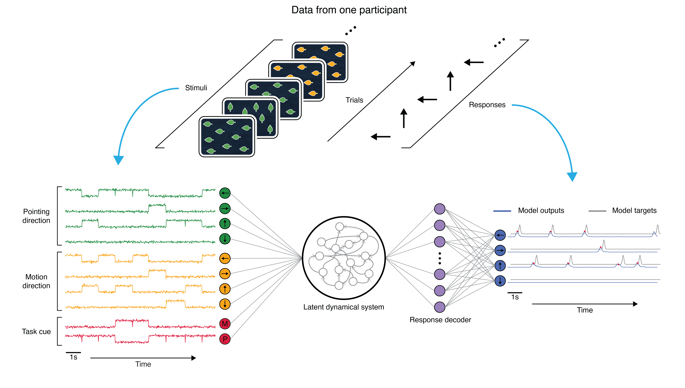
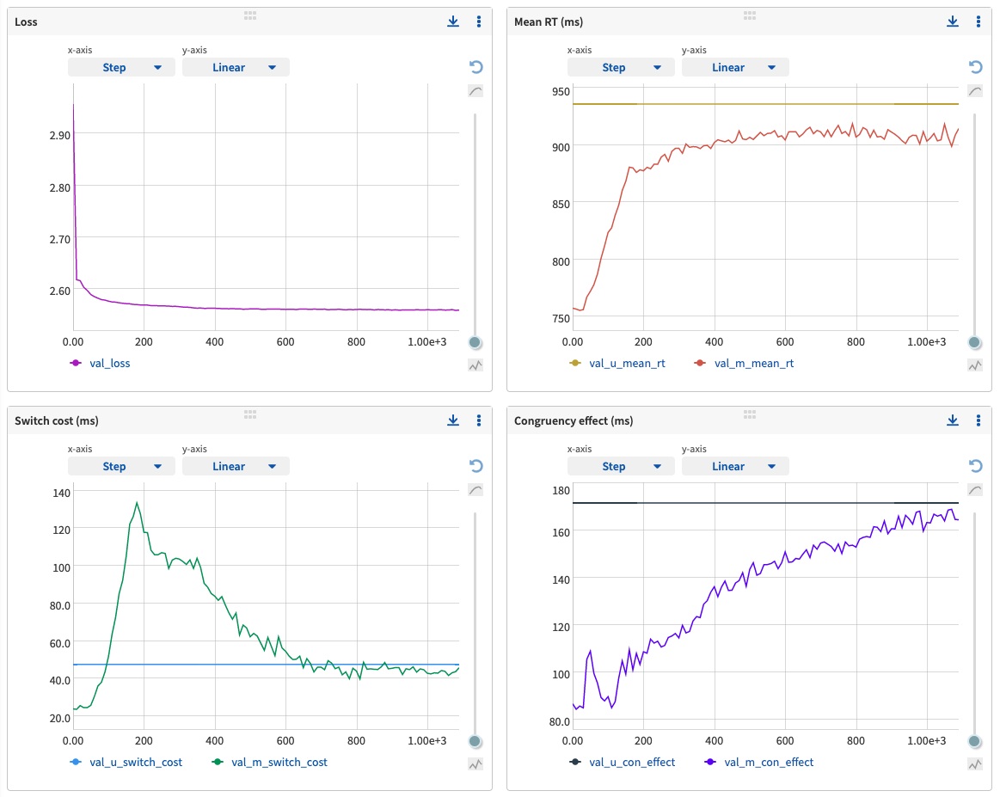
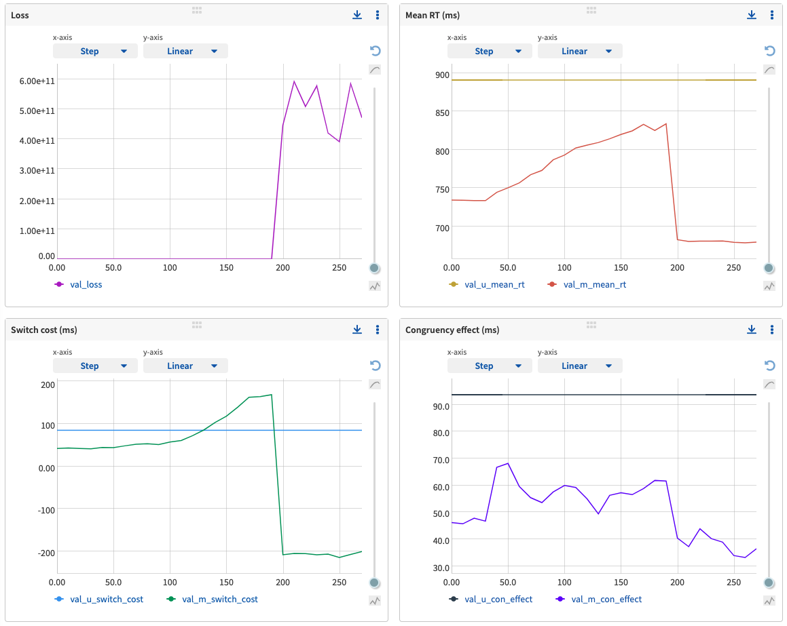

Task-DyVA
------------

Task-DyVA is a framework for modeling sequential response time data from cognitive tasks. This repo contains code to train models and reproduce the analyses from the paper. 

Jaffe, P.I., Poldrack, R.A., Schafer, R.J. & Bissett, P.G. Modelling human behaviour in cognitive tasks with latent dynamical systems. *Nat Hum Behav* (2023).

Trained models & data: [](https://doi.org/10.5281/zenodo.6368412)



Reproduce the figures and analyses from the paper
------------

The easiest and recommended way to reproduce the results from the paper is as follows:

1) Fork the repo from the command line:

```
git clone https://github.com/pauljaffe/task-dyva
```

2) Install the dependencies listed in the environment.yml file and set up a conda environment. If you haven't already, install conda (or miniconda), then create an environment by running:

```
conda env create -f environment.yml
```

This will create an environment named task-dyva and automatically install all of the required dependencies. Activate the environment by running:

```
conda activate task-dyva
``` 

3) Download the trained model/data directories and metadata from Zenodo, linked above (see the instructions for speedy downloading from the command line on the Zenodo page). These should be placed in one directory. For convenience, consider setting the overarching directory as an environment variable $MODEL_DIR (referenced below).

4) Run the summary analyses and create the manuscript figures using the make_main.py and make_supplement.py CLIs. From the manuscript folder:

```
python make_main.py $MODEL_DIR -f "figures"
python make_supplement.py $MODEL_DIR -f "figures"
```

Summary figures will be saved in $MODEL_DIR/figures. By default, the make_main.py script does not repeat computationally intensive preprocessing steps (e.g. recomputing model outputs for each model), but users who wish to repeat this preprocessing can do so by supplying the "-p" flag to the CLI command:

```
python make_main.py $MODEL_DIR -f "figures" -p
```

To play around with the trained models analyzed in the paper, download the models linked above. The figure analysis files in /manuscript provide examples of how to do various analyses. 


Quick start guide to model training
------------

To get started with training new models, do steps 1-3 above, then use the train.py CLI to train a task-DyVA model on a specified user's data. E.g. set $RAW_DATA_DIR to the ages30to39_u3531_expt1 directory downloaded from Zenodo and run:

```
python train.py $RAW_DATA_DIR "/path/to/save/checkpoints" "name_for_experiment"
```

See the train.py script for additional configuration options. 


Hardware requirements
------------

#### Model training
Using the default training parameters on GPU, training a single model typically requires ~30GB RAM, ~1.5GB GPU memory, and takes ~14-30h to train depending on what GPU is used (NVIDIA V100 Tensor Core: ~16h, NVIDIA GTX 1080 Ti: ~24h). Increasing the batch size can substantially reduce model training time, though in our experience the default batch size (128) produces the best model fits. 

#### Reproducing the analyses
The memory required to repeat the analyses from the paper *without* rerunning the preprocessing is minimal (<1GB). Running both make_main.py and make_supplement.py takes ~5mins. total. Rerunning the preprocessing requires more memory (~7GB) and takes about ~17h to run (tested on a 2017 MacBook Pro with a 2.8GHz processor and 16GB RAM). 


Tracking model training
------------

Task-DyVA currently supports two experiment tracking/metric logging solutions: Neptune and TensorBoard. See the train.py CLI for instructions on how to set the logger. 

At each checkpoint epoch (every 10 training epochs by default), both trackers log a variety of model training metrics, model/participant behavior metrics, and example model outputs (metrics described below). Example model outputs at each checkpoint epoch can be visualized in the images tab for both TensorBoard and Neptune. 

### Description of logged variables
We use a shorthand notation to describe the logged variables. The 'val' or 'train' prefix indicates that the metric was evaluated on the validation set or training set, respectively. E.g., '[val/train]\_loss' resolves to either 'val\_loss' or 'train\_loss'. The 'u' or 'm' character in variable names indicates that the metric was evaluated on the participant (a.k.a. user)'s data or the model's outputs, respectively. See the Methods section "Behavior summary statistics" for details on how these metrics are calculated. 

**[val/train]_loss:** Loss evaluated on the validation/training dataset. <br>
**[val/train]_NLL:** The negative log-likelihood component of the loss evaluated on the validation/training dataset. <br>
**val_[u/m]_mean_rt:** Mean response time (RT) in ms for the participant or model. <br>
**val_[u/m]_switch_cost:** Switch cost in ms for the participant or model. <br>
**val_[u/m]_switch_cost_estop:** Switch cost in ms for the participant or model, including RTs from incorrect trials (used for the early stopping calculation). <br>
**val_[u/m]_con_effect:** Congruency effect in ms for the participant or model. <br>
**val_[u/m]_con_effect_estop:** Congruency effect in ms for the participant or model, including RTs from incorrect trials (used for the early stopping calculation). <br>
**val_[u/m]_rt_sd:** RT standard deviation in ms for the participant or model. <br>
**val_[u/m]_accuracy:** Response accuracy for the participant or model. <br>
**val_[u/m]_acc_switch_cost:** Accuracy switch cost for the participant or model. <br>
**val_[u/m]_acc_con_effect:** Accuracy congruency effect for the participant or model. <br>
**anneal_param:** Value of the annealing parameter used in the loss function. <br>
**iteration:** The number of steps the optimization algorithm has taken.  


Troubleshooting model training
------------
Here are example training metrics from a successful run:


The x-axis of each plot corresponds to the training epoch. The entire run is shown up until early stopping was triggered. The upper left plot shows the progression of the loss on the validation set over the course of training. The other three plots track the progression of the model's mean RT, switch cost, and congruency effect relative to the participant.

Occasionally, the loss will diverge and training will ultimately fail. This appears to result from instabilities in the latent dynamical system (e.g. exponential growth), rather than exploding gradients (gradient clipping is used to help combat this). This can be diagnosed by examining the loss, which exhibits a sudden and dramatic increase (see below). The model's behavioral metrics also typically diverge concurrently. One easy fix is to use a different random seed to initialize training. To do so, set the -rs flag in the train.py CLI, e.g.:

```
python train.py $RAW_DATA_DIR "/path/to/save/checkpoints" "name_for_experiment" -rs 42
```

